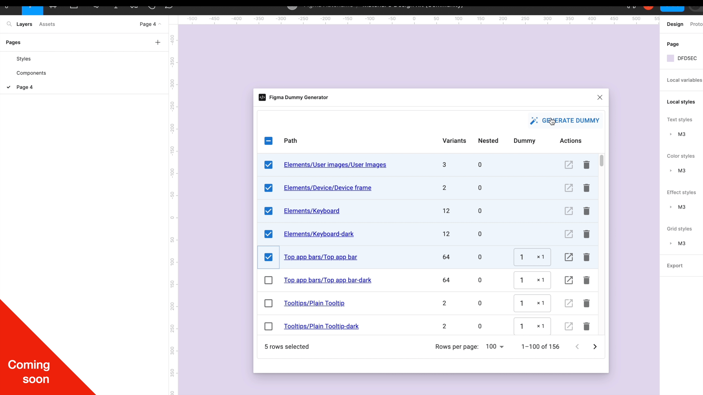

# Figma Plugin React Template

    

# Figma-dummy-gen

Figma-dummy-gen is a standalone project designed to support custom training for [Figma Autoname](https://figmaautomane.org/). This Figma plugin allows you to generate and extract images directly from your Figma design library, providing the necessary data for machine learning model training.

## Purpose

The primary purpose of Figma-dummy-gen is to facilitate the creation of a robust dataset for training your machine learning models. The quality and diversity of your dataset significantly impact the performance of your model. Figma-dummy-gen helps you enrich your dataset by generating a variety of images based on your Figma design library.

## Contribution

Contributions to the Figma-dummy-gen project are welcome. Whether it's a bug report, new feature, correction, or additional documentation, we greatly value your feedback and contributions.

### Quickstart

Follow these steps to set up the development environment:

1. Run `yarn` to install dependencies.
2. Run `yarn build:watch` to start webpack in watch mode.
3. Open `Figma` -> `Plugins` -> `Development` -> `Import plugin from manifest...` and choose `manifest.json` file from this repo.

To modify the UI of your plugin (the react code), start editing [App.tsx](./src/app/components/App.tsx).  
To interact with the Figma API, edit [controller.ts](./src/plugin/controller.ts).  
For more information, refer to the [Figma API Overview](https://www.figma.com/plugin-docs/api/api-overview/).

### Toolings

This project uses:

- React + Webpack
- MUI5
- TypeScript
- Prettier precommit hook

By using Figma-dummy-gen, you can streamline the process of preparing your dataset, ensuring that your machine learning model has the best possible data to learn from.